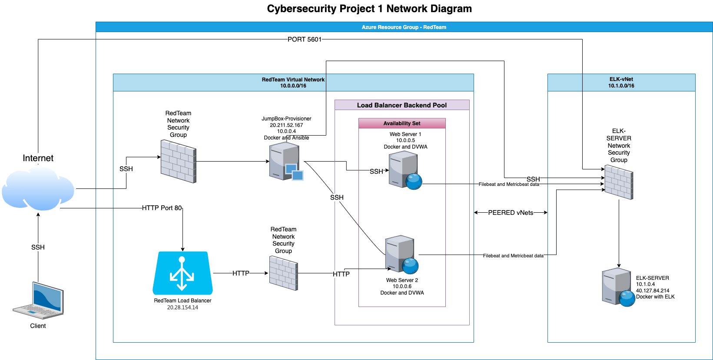
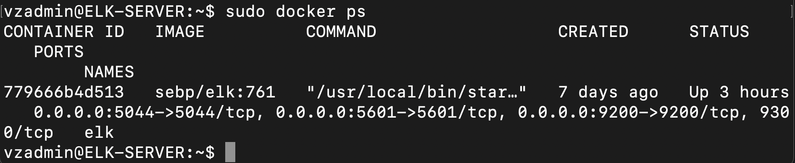

## Automated ELK Stack Deployment

The files in this repository were used to configure the network depicted below.



These files have been tested and used to generate a live ELK deployment on Azure. They can be used to either recreate the entire deployment pictured above. Alternatively, select portions of the filebeat-playbook.yml file may be used to install only certain pieces of it, such as Filebeat.

This document contains the following details:
- Description of the Topology
- Access Policies
- ELK Configuration
  - Beats in Use
  - Machines Being Monitored
- How to Use the Ansible Build


### Description of the Topology

The main purpose of this network is to expose a load-balanced and monitored instance of DVWA, the D*mn Vulnerable Web Application.

Load balancing ensures that the application will be highly available, in addition to restricting access to the network.

Integrating an ELK server allows users to easily monitor the vulnerable VMs for changes to the specific log files and system metrics and statistics.

The configuration details of each machine may be found below.

| Name                 | Function   | IP Address | Operating System |
|----------------------|------------|------------|------------------|
| Jump-Box-Provisioner | Gateway    | 10.0.0.4   | Linux            |
| Web-1                | Web Server | 10.0.0.5   | Linux            |
| Web-2                | Web Server | 10.0.0.6   | Linux            |
| ELK-SERVER           | Monitoring | 10.1.0.4   | Linux            |

### Access Policies

The machines on the internal network are not exposed to the public Internet.

Only the Jump-Box-Provisioner machine can accept connections from the Internet. Access to this machine is only allowed from the following IP addresses: 99.155.149.81

Machines within the network can only be accessed by each other. Web-1 and Web-2 send information to the ELK-SERVER

A summary of the access policies in place can be found in the table below.

| Name                 | Publicly Accessible | Allowed IP Address |
|----------------------|---------------------|--------------------|
| Jump-Box-Provisioner | Yes                 | 99.155.149.81      |
| Web-1                | No                  | 10.0.0.0/24        |
| Web-2                | No                  | 10.0.0.0/24        |
| ELK-SERVER           | No                  | 10.0.0.0/24        |

### Elk Configuration

Ansible was used to automate configuration of the ELK machine. No configuration was performed manually, which is advantageous because the ansible configuration can used to update multiple web servers by changing a single YAML file. Ansible can also perform multiple tasks in one run through step by step.

The playbook implements the following tasks:
- Installs docker.io, pip and the docker python module.
- Increases the virtual memory of the system to 262144.
- Downloads and launches an ELK docker container which is also set to start automatically when the server boots. It also publishes the following ports: 5601, 9200, 5044
- Enables docker service to run on boot.

The following screenshot displays the result of running `docker ps` after successfully configuring the ELK instance.



### Target Machines & Beats
This ELK server is configured to monitor the following machines:
- Web-1 at 10.0.0.5
- Web-2 at 10.0.0.6

We have installed the following Beats on these machines:
- Filebeat
- Metricbeat

These Beats allow us to collect the following information from each machine:
- Filebeat: Filebeat detects changes to the filesystem. Specifically, we use it to collect Apache logs.
- Metricbeat: Metricbeat detects changes in system metrics, such as CPU usage. We use it to detect SSH login attempts, failed sudo escalations, and CPU/RAM statistics.

### Using the Playbook
In order to use the playbook, you will need to have an Ansible control node already configured. Assuming you have such a control node provisioned:

SSH into the control node and follow the steps below:
- Copy the elk_playbook.yml file to /etc/ansible.
- Update the hosts file located in /etc/ansible file to include references to Web-1 and Web-2 as websevers and ELK-SERVER as elk -
```
[webservers]

10.0.0.5 ansible_python_interpreter=/usr/bin/python3
10.0.0.6 ansible_python_interpreter=/usr/bin/python3

[elk]
10.1.0.4 ansible_python_interpreter=/usr/bin/python3
```
- The following command can be used to run the playbook which inside the ansible control node -
```
ansible-playbook elk_playbook.yml
```
- Run the playbook, and run curl http://10.1.0.4:5601 to check that the installation worked as expected. If the installation succeeded, this command should print HTML to the console.
